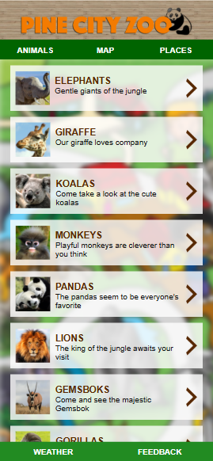
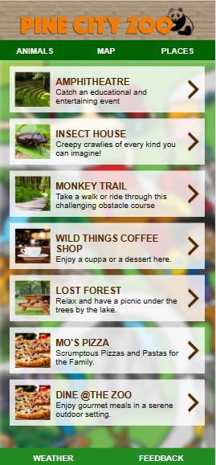
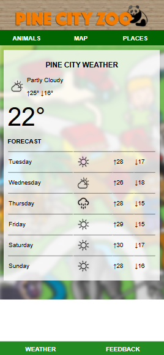

# 🦁 Pine City Zoo Web App

A fictional **zoo tour guide** website built using **HTML** and **CSS**. This static web app helps visitors explore animals, places, and navigate the zoo — with added features like a weather page and a feedback form.

## 🌿 Overview

**Pine City Zoo Web App** is a simple, fast, and user-friendly website that works as a digital tour guide for zoo visitors. It features detailed pages about animals, locations around the zoo, a map, current weather info, and a feedback form to improve visitor experience.

## 📄 Main Pages

### 1. 🐾 Animals Page
- Lists animals you can find in the zoo.
- Clicking an animal opens a detail page with:
  - Animal info
  - Where they live in the zoo

### 2. 🗺️ Map Page
- Displays a static **map of the zoo**.
- Helps users visually navigate the animal zones and other locations.

### 3. 🛍️ Places Page
- Lists places like shops, restaurants, picnic areas.
- Each item links to a detail page showing:
  - Description of the place
  - Location within the zoo

### 4. 🌦️ Weather Page
- Shows current weather information for Pine City.
- Helps visitors plan their day at the zoo.
- (Static weather info or placeholder design)

### 5. 📝 Feedback Page
- A simple form where users can submit:
  - Comments
  - Suggestions
  - Ratings
- (No backend functionality — purely HTML & CSS)

## 📸 Preview

  
  
  

## ✨ Features

- Fully static site (no backend)
- Clear navigation between pages
- Clean and responsive layout
- Simple UX suitable for kids and families

## 🛠️ Tech Stack

- **HTML5** – Page structure  
- **CSS3** – Styling and layout

## 📁 Folder Structure

├── index.html # Homepage. contain - map
├── animals.html # List of animals
├── [animal name].html # Individual animal detail pages
├── places.html # List of zoo places
├── place-[name].html # Place detail pages
├── weather.html # Weather info page
├── feedback.html # Feedback form
├── styles.css # Main styling
└── images/ # Zoo images, map, weather icons, etc.
